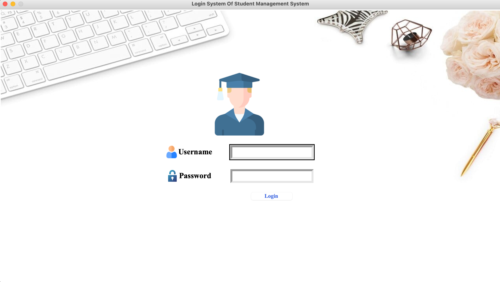
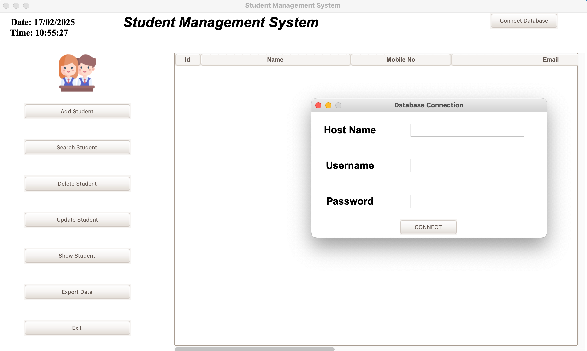
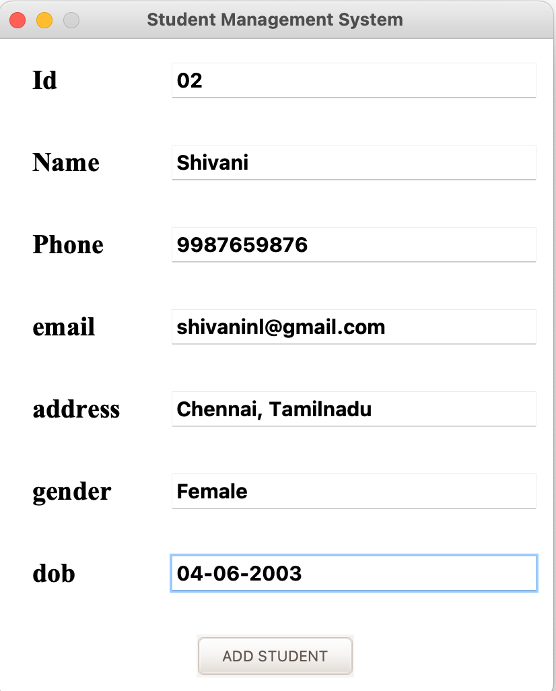
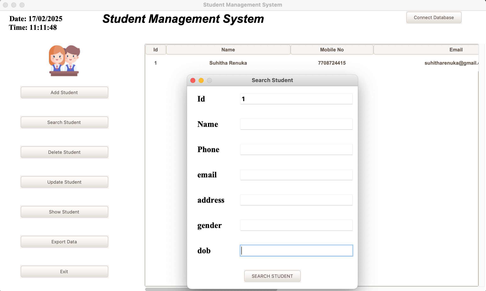
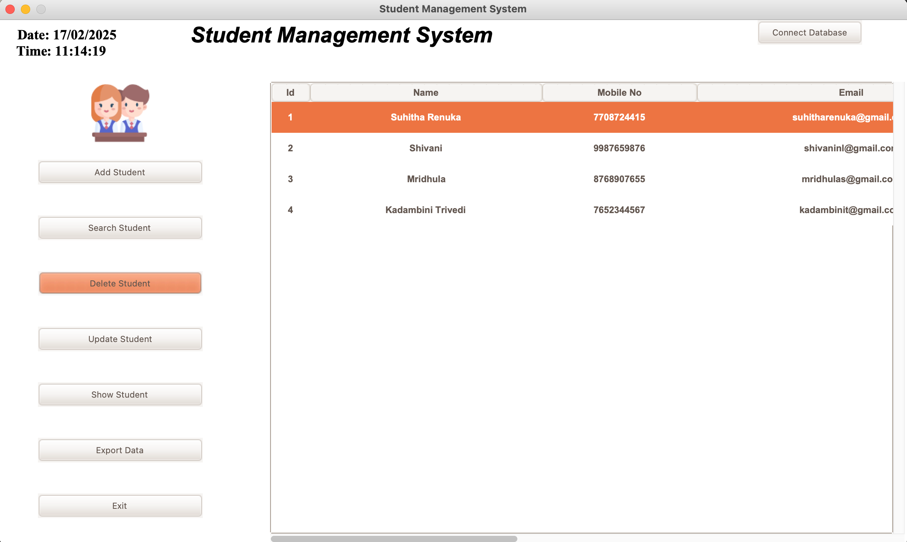
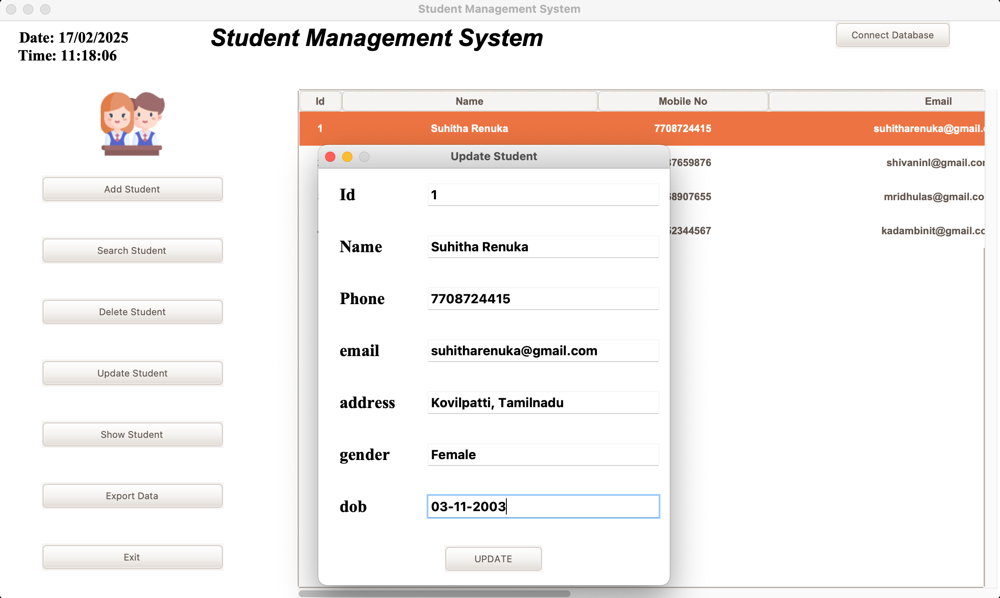
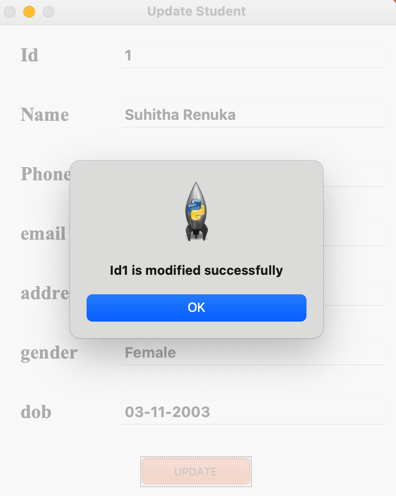
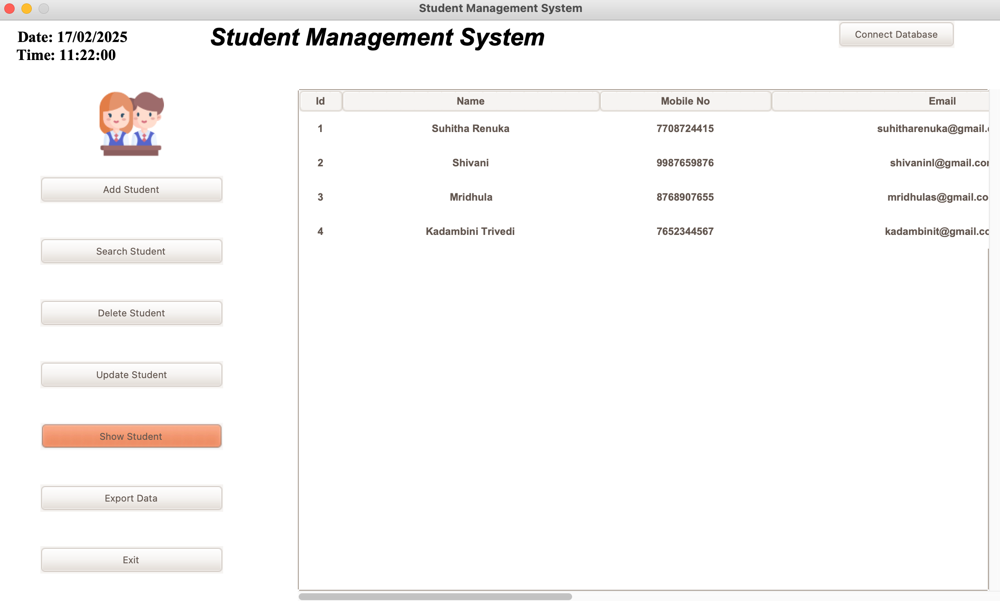
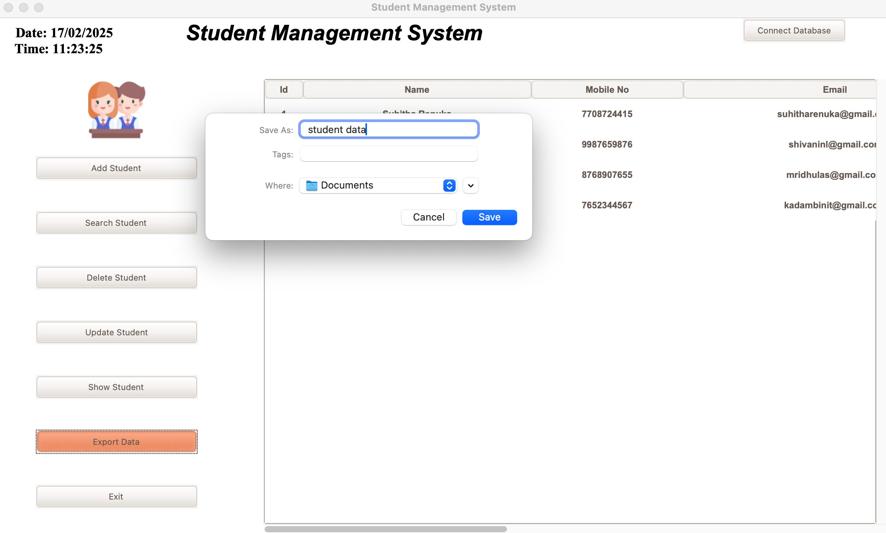
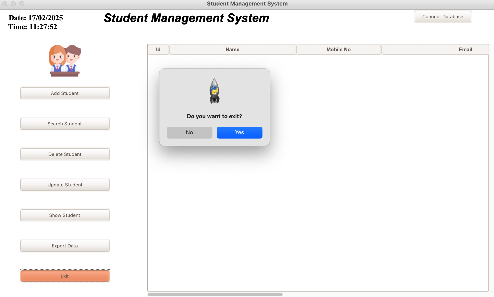

# 🏫 Student Management System

A simple and efficient **Student Management System** built using **Tkinter (Python's GUI Library)** and **SQLite** to handle student records. It allows users to **add, search, update, delete, export, and display student information** effortlessly.

## ✨ Features

- **User Authentication** - Secure login system
- **Add Students** - Store student records with relevant details
- **Search Students** - Find students using their name, roll number, or other criteria
- **Update Records** - Modify student details easily
- **Delete Students** - Remove student records permanently
- **View All Students** - Display the full list of students in a structured table
- **Export Data** - Save student data as an Excel or CSV file
- **Exit Confirmation** - Prompt before exiting the application

## 🖼️ Screenshots

### 🔹 Login Window


### 🔹 Database Connection


### 🔹 Add Student Functionality


### 🔹 Search Functionality


### 🔹 Delete Student Window


### 🔹 Update Student Window


### 🔹 Update Success Message


### 🔹 Show All Students Window



### 🔹 Export Functionality


### 🔹 Exit Window



## 🛠️ Installation

### 📌 Requirements
- Python 3.x
- Tkinter (comes pre-installed with Python)
- SQLite3 (comes pre-installed with Python)
- Pandas (for exporting data)

### 📥 Setup
1. Clone the repository  
   ```bash
   git clone https://github.com/your-username/student-management-system.git
   cd student-management-system
## Conclusion

<p>Feel free to reach out for any questions or suggestions about this project. I'm open to discussions and eager to assist.
  <a href="https://linkedin.com/in/suhitha-renuka-12b37025a">
   Linkedln | Suhitha Renuka</a><br>
  <p> Don't forget to follow and star ⭐ the repository if you find it valuable.</p>
